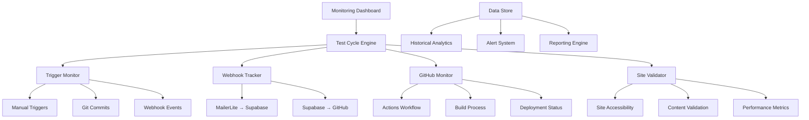
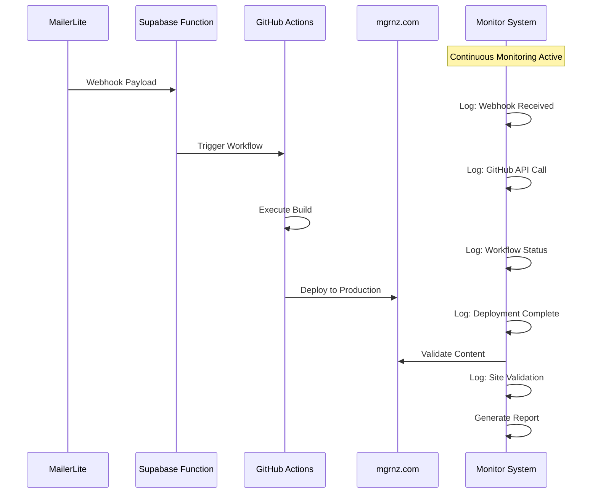
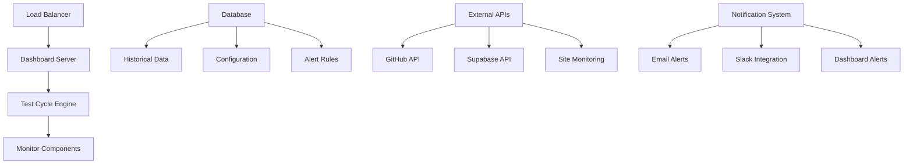

# Design Document

## Overview

This design document outlines the technical architecture for a comprehensive automated test cycle system that monitors and tracks the entire mgrnz.com blog deployment pipeline. The system will provide real-time visibility into all triggers, webhook flows, GitHub Actions execution, and production site updates, enabling proactive monitoring and rapid issue identification.

## Architecture

### System Architecture Overview



### Monitoring Flow Architecture



## Components and Interfaces

### 1. Test Cycle Engine (Core Orchestrator)

**Purpose:** Central coordinator that manages all monitoring activities and maintains pipeline state

**Components:**
- `test-cycle-engine.js` - Main orchestration logic
- `pipeline-tracker.js` - Unique ID generation and state management
- `config-manager.js` - Configuration and environment management

**Key Functions:**
```javascript
class TestCycleEngine {
  async startMonitoring()
  async createPipelineRun(trigger)
  async updatePipelineStage(runId, stage, status)
  async completePipelineRun(runId, result)
  async generateReport(runId)
}
```

**Configuration:**
```json
{
  "monitoring": {
    "interval": 30000,
    "timeout": 300000,
    "retryAttempts": 3
  },
  "endpoints": {
    "supabase": "https://your-project.supabase.co/functions/v1/ml-to-hugo-public",
    "github": "https://api.github.com/repos/captjreacher/mgrnz-blog",
    "site": "https://mgrnz.com"
  }
}
```

### 2. Trigger Monitor

**Purpose:** Detects and logs all events that initiate the deployment pipeline

**Components:**
- `trigger-detector.js` - Monitors for deployment triggers
- `git-monitor.js` - Watches for git commits and pushes
- `webhook-listener.js` - Intercepts webhook events

**Trigger Types Monitored:**
1. **Manual Triggers**
   - GitHub Actions manual dispatch
   - Direct deployment scripts
   - Admin interface deployments

2. **Git-based Triggers**
   - Commits to main branch
   - Pull request merges
   - Tag creation

3. **Webhook Triggers**
   - MailerLite campaign webhooks
   - External API calls
   - Scheduled deployments

**Implementation:**
```javascript
class TriggerMonitor {
  async detectTriggers() {
    // Monitor GitHub API for recent workflow runs
    // Check git log for new commits
    // Listen for webhook events
  }
  
  async logTrigger(type, source, metadata) {
    const runId = generateUniqueId();
    await this.engine.createPipelineRun({
      id: runId,
      trigger: { type, source, metadata },
      timestamp: new Date().toISOString()
    });
    return runId;
  }
}
```

### 3. Webhook Tracker

**Purpose:** Monitors webhook flows between MailerLite, Supabase, and GitHub

**Components:**
- `mailerlite-webhook-monitor.js` - Tracks ML → Supabase webhooks
- `supabase-github-monitor.js` - Tracks Supabase → GitHub API calls
- `webhook-validator.js` - Validates webhook payloads and responses

**Monitoring Capabilities:**

#### MailerLite to Supabase Tracking
```javascript
class MailerLiteWebhookMonitor {
  async monitorWebhook(runId) {
    // Intercept webhook calls to Supabase function
    // Log payload size, authentication status
    // Track processing time and response codes
    // Validate webhook token authentication
  }
  
  async validateWebhookFlow() {
    // Test webhook endpoint accessibility
    // Verify authentication mechanisms
    // Check error handling responses
  }
}
```

#### Supabase to GitHub Tracking
```javascript
class SupabaseGitHubMonitor {
  async monitorGitHubAPI(runId) {
    // Track GitHub API calls from Supabase function
    // Log API response codes and timing
    // Monitor rate limiting and retry logic
    // Validate workflow dispatch success
  }
}
```

### 4. GitHub Actions Monitor

**Purpose:** Tracks GitHub Actions workflow execution and build processes

**Components:**
- `github-actions-monitor.js` - Monitors workflow execution
- `build-process-tracker.js` - Tracks Hugo build steps
- `deployment-monitor.js` - Monitors deployment to GitHub Pages

**Monitoring Features:**

#### Workflow Execution Tracking
```javascript
class GitHubActionsMonitor {
  async monitorWorkflow(runId, workflowId) {
    // Poll GitHub Actions API for workflow status
    // Track individual job and step execution
    // Monitor build logs for errors and warnings
    // Capture build artifacts and deployment status
  }
  
  async analyzeWorkflowPerformance(workflowRun) {
    return {
      totalDuration: workflowRun.updated_at - workflowRun.created_at,
      buildTime: this.extractBuildTime(workflowRun),
      deploymentTime: this.extractDeploymentTime(workflowRun),
      bottlenecks: this.identifyBottlenecks(workflowRun)
    };
  }
}
```

#### Build Process Analysis
- Hugo build timing and output analysis
- Dependency installation monitoring
- Asset optimization tracking
- Error detection and categorization

### 5. Production Site Validator

**Purpose:** Validates that changes are successfully deployed and accessible on mgrnz.com

**Components:**
- `site-accessibility-checker.js` - Tests site availability and performance
- `content-validator.js` - Validates deployed content matches expectations
- `performance-monitor.js` - Tracks site performance metrics

**Validation Capabilities:**

#### Site Accessibility Validation
```javascript
class SiteAccessibilityChecker {
  async validateSiteAccess(runId) {
    // Test HTTPS accessibility
    // Verify SSL certificate validity
    // Check DNS resolution
    // Validate redirect configurations
  }
  
  async performHealthCheck() {
    return {
      status: 'healthy',
      responseTime: 250,
      sslValid: true,
      contentLength: 45678,
      lastModified: '2025-10-28T12:00:00Z'
    };
  }
}
```

#### Content Validation
```javascript
class ContentValidator {
  async validateDeployedContent(runId, expectedChanges) {
    // Compare deployed content with expected changes
    // Verify new posts appear correctly
    // Check admin functionality accessibility
    // Validate subscription form functionality
  }
}
```

### 6. Data Storage and Analytics

**Purpose:** Stores monitoring data and provides analytics capabilities

**Components:**
- `data-store.js` - Handles data persistence
- `analytics-engine.js` - Generates insights and trends
- `report-generator.js` - Creates monitoring reports

**Data Models:**

#### Pipeline Run Record
```json
{
  "id": "run_20251028_120000_abc123",
  "trigger": {
    "type": "webhook",
    "source": "mailerlite",
    "timestamp": "2025-10-28T12:00:00Z",
    "metadata": {}
  },
  "stages": [
    {
      "name": "webhook_received",
      "status": "completed",
      "startTime": "2025-10-28T12:00:01Z",
      "endTime": "2025-10-28T12:00:02Z",
      "data": {}
    }
  ],
  "status": "completed",
  "duration": 180000,
  "success": true
}
```

#### Webhook Record
```json
{
  "id": "webhook_abc123",
  "runId": "run_20251028_120000_abc123",
  "source": "mailerlite",
  "destination": "supabase",
  "payload": {},
  "response": {},
  "timing": {
    "sent": "2025-10-28T12:00:01Z",
    "received": "2025-10-28T12:00:02Z",
    "processed": "2025-10-28T12:00:03Z"
  },
  "status": "success"
}
```

### 7. Real-Time Dashboard

**Purpose:** Provides live monitoring interface and alerting capabilities

**Components:**
- `dashboard-server.js` - Web server for monitoring interface
- `websocket-handler.js` - Real-time updates
- `alert-manager.js` - Alert generation and notification

**Dashboard Features:**
- Live pipeline status display
- Historical performance charts
- Error rate monitoring
- Performance trend analysis
- Alert configuration interface

## Data Models

### Pipeline Execution Model
```typescript
interface PipelineRun {
  id: string;
  trigger: TriggerEvent;
  stages: PipelineStage[];
  status: 'running' | 'completed' | 'failed' | 'timeout';
  startTime: Date;
  endTime?: Date;
  duration?: number;
  success: boolean;
  errors: ErrorRecord[];
  metrics: PerformanceMetrics;
}

interface TriggerEvent {
  type: 'manual' | 'git' | 'webhook' | 'scheduled';
  source: string;
  timestamp: Date;
  metadata: Record<string, any>;
}

interface PipelineStage {
  name: string;
  status: 'pending' | 'running' | 'completed' | 'failed';
  startTime?: Date;
  endTime?: Date;
  duration?: number;
  data: Record<string, any>;
  errors: string[];
}
```

### Webhook Tracking Model
```typescript
interface WebhookRecord {
  id: string;
  runId: string;
  source: 'mailerlite' | 'github' | 'external';
  destination: 'supabase' | 'github' | 'site';
  payload: Record<string, any>;
  response: {
    status: number;
    body: any;
    headers: Record<string, string>;
  };
  timing: {
    sent: Date;
    received: Date;
    processed: Date;
  };
  authentication: {
    method: string;
    success: boolean;
    errors?: string[];
  };
  retries: RetryAttempt[];
}
```

### Performance Metrics Model
```typescript
interface PerformanceMetrics {
  webhookLatency: number;
  buildTime: number;
  deploymentTime: number;
  siteResponseTime: number;
  totalPipelineTime: number;
  errorRate: number;
  successRate: number;
  throughput: number;
}
```

## Error Handling

### Error Categories and Responses

#### Webhook Errors
- **Authentication Failures:** Log invalid tokens, implement retry with backoff
- **Payload Validation Errors:** Capture malformed data, provide detailed error messages
- **Network Timeouts:** Implement exponential backoff retry mechanism
- **Rate Limiting:** Track API usage, implement intelligent throttling

#### GitHub Actions Errors
- **Build Failures:** Capture build logs, identify common failure patterns
- **Deployment Errors:** Monitor GitHub Pages deployment status
- **Permission Issues:** Detect and alert on token/permission problems
- **Resource Constraints:** Monitor for timeout and resource limit issues

#### Site Validation Errors
- **Accessibility Issues:** DNS resolution failures, SSL certificate problems
- **Content Validation Failures:** Missing or incorrect content deployment
- **Performance Degradation:** Slow response times, high error rates

### Error Recovery Strategies

```javascript
class ErrorHandler {
  async handleWebhookError(error, context) {
    switch (error.type) {
      case 'authentication':
        await this.alertManager.sendAlert('webhook_auth_failure', error);
        break;
      case 'timeout':
        await this.retryManager.scheduleRetry(context, 'exponential');
        break;
      case 'rate_limit':
        await this.throttleManager.implementBackoff(context);
        break;
    }
  }
  
  async handleBuildError(error, workflowRun) {
    const analysis = await this.analyzeBuildLogs(workflowRun);
    await this.reportGenerator.createErrorReport(error, analysis);
    
    if (analysis.isRecoverable) {
      await this.retryManager.scheduleWorkflowRetry(workflowRun);
    }
  }
}
```

## Testing Strategy

### Unit Testing
- **Component Testing:** Individual monitor components
- **Data Model Testing:** Validation of data structures and persistence
- **Error Handling Testing:** Comprehensive error scenario coverage
- **Performance Testing:** Load testing for monitoring overhead

### Integration Testing
- **End-to-End Pipeline Testing:** Complete workflow from trigger to validation
- **Webhook Flow Testing:** MailerLite → Supabase → GitHub integration
- **GitHub Actions Integration:** Workflow monitoring and analysis
- **Site Validation Testing:** Production site accessibility and content validation

### Performance Testing
- **Monitoring Overhead:** Ensure monitoring doesn't impact pipeline performance
- **Scalability Testing:** Handle multiple concurrent pipeline runs
- **Data Storage Performance:** Efficient storage and retrieval of monitoring data
- **Dashboard Responsiveness:** Real-time updates without performance degradation

### Reliability Testing
- **Failure Recovery:** System behavior during component failures
- **Data Consistency:** Ensure monitoring data accuracy during failures
- **Alert Reliability:** Verify alerts are sent and received correctly
- **Historical Data Integrity:** Maintain data consistency over time

## Implementation Approach

### Phase 1: Core Infrastructure
1. **Test Cycle Engine Setup**
   - Implement core orchestration logic
   - Create pipeline tracking system
   - Set up configuration management

2. **Data Storage Implementation**
   - Design and implement data models
   - Set up persistent storage system
   - Create data access layer

### Phase 2: Monitoring Components
1. **Trigger Monitor Implementation**
   - Build git commit monitoring
   - Implement webhook detection
   - Create manual trigger tracking

2. **Webhook Tracker Development**
   - Implement MailerLite webhook monitoring
   - Build Supabase to GitHub tracking
   - Create webhook validation system

### Phase 3: GitHub and Site Monitoring
1. **GitHub Actions Monitor**
   - Implement workflow execution tracking
   - Build build process monitoring
   - Create deployment status tracking

2. **Site Validator Implementation**
   - Build accessibility checking
   - Implement content validation
   - Create performance monitoring

### Phase 4: Dashboard and Analytics
1. **Real-Time Dashboard**
   - Create web-based monitoring interface
   - Implement real-time updates
   - Build alert management system

2. **Analytics and Reporting**
   - Implement historical data analysis
   - Create performance trend tracking
   - Build automated reporting system

### Phase 5: Integration and Optimization
1. **End-to-End Integration Testing**
   - Validate complete monitoring pipeline
   - Test error handling and recovery
   - Optimize performance and reliability

2. **Production Deployment**
   - Deploy monitoring system to production
   - Configure alerts and notifications
   - Provide documentation and training

## Security Considerations

### Authentication and Authorization
- **API Token Security:** Secure storage and rotation of GitHub and Supabase tokens
- **Webhook Authentication:** Validate webhook signatures and tokens
- **Dashboard Access:** Implement authentication for monitoring dashboard

### Data Privacy
- **Sensitive Data Handling:** Sanitize webhook payloads before storage
- **Access Logging:** Track access to monitoring data and dashboards
- **Data Retention:** Implement appropriate data retention policies

### Network Security
- **HTTPS Enforcement:** All monitoring communications over HTTPS
- **Rate Limiting:** Implement rate limiting to prevent abuse
- **Input Validation:** Validate all inputs to prevent injection attacks

## Deployment Architecture

### Production Environment


### Scalability Considerations
- **Horizontal Scaling:** Support multiple monitor instances
- **Database Optimization:** Efficient indexing and query optimization
- **Caching Strategy:** Cache frequently accessed monitoring data
- **Resource Management:** Monitor and optimize system resource usage