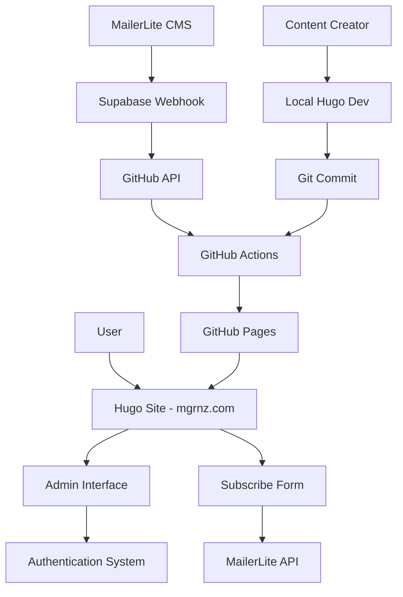
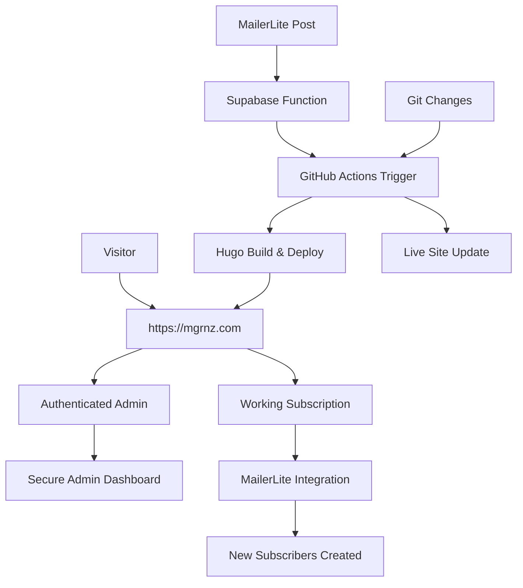

# Design Document

## Overview

This design document outlines the technical approach to finalize the mgrnz.com blog site for production deployment. The system is a Hugo-based static site with admin functionality, MailerLite integration, and automated deployment via GitHub Actions. The current architecture has most components in place but requires fixes to authentication, API integrations, and deployment pipeline.

## Architecture

### Current System Architecture



### Target Production Architecture



## Components and Interfaces

### 1. Admin Authentication System

**Current State:** Admin menu exists but authentication is incomplete
**Target State:** Secure authentication flow with session management

**Components:**
- `layouts/partials/admin-menu.html` - Admin menu with auth check
- `static/admin-production.html` - Main admin interface
- `static/admin-secure.html` - Password-protected version

**Authentication Flow:**
1. User clicks admin link on homepage
2. System checks for valid auth token in localStorage
3. If no valid token, redirect to login screen
4. On successful auth, store token with 24-hour expiry
5. Grant access to admin dashboard

**Implementation Details:**
- Use existing localStorage-based session management
- Implement proper login screen if missing
- Ensure admin menu properly checks authentication state
- Maintain existing access codes: `admin2025`, `mgrnz-admin`, `blog-secure`

### 2. MailerLite Subscription Integration

**Current State:** Form exists but API calls not creating contacts
**Target State:** Working subscription flow with contact creation

**Components:**
- `content/subscribe.md` - Subscription page with redirect
- MailerLite Universal script (already loaded in head)
- Form ID: Based on existing MailerLite setup

**Integration Flow:**
1. User visits `/subscribe/` page
2. Page redirects to MailerLite hosted form
3. User submits subscription
4. MailerLite processes and creates contact
5. User receives confirmation

**Diagnostic Approach:**
1. Verify MailerLite form ID is correct
2. Check if Universal script is loading properly
3. Test form submission and API response
4. Validate MailerLite dashboard for new contacts
5. Fix any API key or configuration issues

### 3. MailerLite to GitHub Integration

**Current State:** Supabase function exists, may need configuration updates
**Target State:** Working webhook flow from MailerLite to GitHub

**Components:**
- `supabase/functions/ml-to-hugo-public/index.ts` - Webhook handler
- GitHub Actions workflow for deployment
- MailerLite webhook configuration

**Integration Flow:**
1. Blog post created in MailerLite
2. MailerLite sends webhook to Supabase function
3. Supabase function formats content for Hugo
4. Function triggers GitHub Actions via API
5. GitHub Actions builds and deploys site

**Configuration Requirements:**
- Verify `GITHUB_TOKEN` secret in Supabase
- Ensure `WEBHOOK_TOKEN` matches MailerLite configuration
- Confirm GitHub repository permissions
- Test webhook endpoint accessibility

### 4. GitHub Actions Deployment Pipeline

**Current State:** Workflow exists but site not updating
**Target State:** Reliable auto-deployment on commits

**Components:**
- `.github/workflows/deploy-gh-pages.yml` - Main deployment workflow
- Hugo build configuration
- GitHub Pages deployment settings

**Pipeline Flow:**
1. Code changes pushed to main branch
2. GitHub Actions triggers automatically
3. Hugo builds site with version 0.150.1
4. Built site deployed to GitHub Pages
5. Site accessible at https://mgrnz.com

**Diagnostic Approach:**
1. Check GitHub Actions logs for errors
2. Verify Hugo version compatibility
3. Ensure GitHub Pages is properly configured
4. Test manual workflow dispatch
5. Validate CNAME and domain settings

### 5. Domain Configuration

**Current State:** Domain configured but may need DNS updates
**Target State:** https://mgrnz.com serving the Hugo site

**Components:**
- DNS configuration pointing to GitHub Pages
- CNAME file in repository
- SSL certificate configuration

**Configuration Elements:**
- CNAME record: `mgrnz.com` → GitHub Pages IP
- Repository CNAME file: `www.mgrnz.com`
- GitHub Pages custom domain setting
- SSL certificate auto-provisioning

## Data Models

### Blog Post Structure
```yaml
---
title: "Post Title"
date: 2025-10-28T12:00:00+13:00
draft: false
tags: ["AI", "Technology"]
categories: ["Business"]
summary: "Post excerpt"
description: "SEO description"
featured: false
---

# Post Content
Markdown content here...
```

### Authentication Token
```javascript
{
  admin_auth_token: "secure-token-string",
  admin_auth_time: "timestamp-milliseconds",
  expiry: "24-hours-from-creation"
}
```

### MailerLite Webhook Payload
```json
{
  "token": "webhook-security-token",
  "post": {
    "title": "Blog Post Title",
    "content": "Markdown content",
    "date": "2025-10-28",
    "tags": ["tag1", "tag2"]
  }
}
```

## Error Handling

### Authentication Errors
- **Invalid Token:** Clear localStorage and redirect to login
- **Expired Session:** Show session expired message and re-authenticate
- **Missing Credentials:** Display login form with error message

### MailerLite Integration Errors
- **API Failure:** Log error and show user-friendly message
- **Invalid Form ID:** Fallback to direct MailerLite URL
- **Network Issues:** Retry mechanism with exponential backoff

### Deployment Pipeline Errors
- **Build Failures:** Detailed error logging in GitHub Actions
- **Permission Issues:** Clear error messages about token/permission problems
- **Hugo Version Conflicts:** Ensure consistent Hugo version across environments

### Domain Configuration Errors
- **DNS Propagation:** Clear instructions for DNS configuration
- **SSL Issues:** Automatic retry and fallback to HTTP if needed
- **CNAME Conflicts:** Validation and correction of CNAME settings

## Testing Strategy

### Authentication Testing
1. **Unit Tests:** Token validation and expiry logic
2. **Integration Tests:** Full authentication flow
3. **Security Tests:** Token manipulation and bypass attempts
4. **User Experience Tests:** Login flow across different devices

### MailerLite Integration Testing
1. **API Tests:** Direct API calls to MailerLite
2. **Form Tests:** Subscription form submission
3. **Webhook Tests:** End-to-end webhook processing
4. **Error Handling Tests:** Network failures and invalid data

### Deployment Pipeline Testing
1. **Build Tests:** Hugo build with various content types
2. **Deployment Tests:** GitHub Actions workflow execution
3. **Integration Tests:** Full commit-to-live-site flow
4. **Performance Tests:** Build and deployment timing

### Domain Configuration Testing
1. **DNS Tests:** Domain resolution and routing
2. **SSL Tests:** Certificate validity and HTTPS enforcement
3. **Redirect Tests:** Proper URL handling and redirects
4. **Cross-browser Tests:** Site accessibility across browsers

## Implementation Approach

### Phase 1: Authentication Fix
1. Review current admin menu authentication logic
2. Implement missing login screen if needed
3. Test authentication flow end-to-end
4. Ensure proper session management

### Phase 2: MailerLite Integration
1. Diagnose current subscription form issues
2. Test MailerLite API connectivity
3. Verify form configuration and IDs
4. Validate contact creation in MailerLite dashboard

### Phase 3: Webhook Integration
1. Test Supabase function configuration
2. Verify GitHub token and permissions
3. Test webhook endpoint manually
4. Validate end-to-end content creation flow

### Phase 4: Deployment Pipeline
1. Analyze GitHub Actions logs for errors
2. Fix any Hugo version or build issues
3. Test manual and automatic deployments
4. Verify site updates appear live

### Phase 5: Domain Configuration
1. Verify DNS settings and propagation
2. Test HTTPS certificate and SSL
3. Validate site accessibility at https://mgrnz.com
4. Ensure proper redirects and routing

### Phase 6: Integration Testing
1. Test complete end-to-end workflows
2. Validate all components working together
3. Performance testing and optimization
4. Documentation and handoff